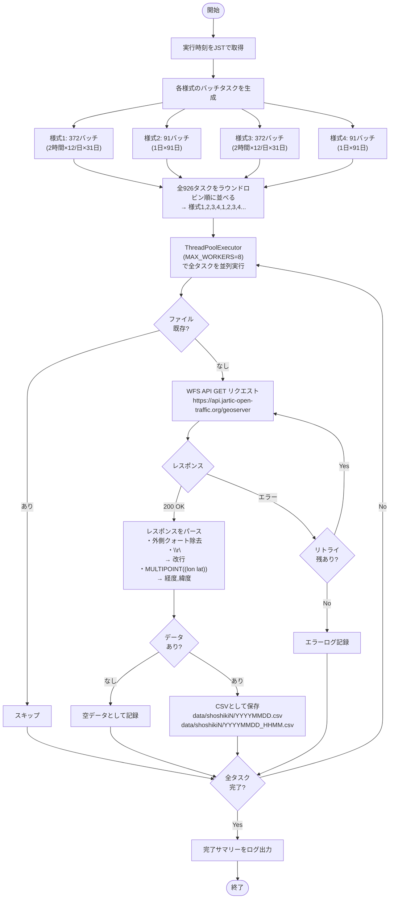

# japan-jartic-traffic-data

国土交通省が提供する [JARTIC オープン交通データ](https://www.jartic-open-traffic.org/) を一括取得するスクリプト。

全国2,060ヶ所の一般国道（直轄国道）における方向別交通量データをWFS APIで取得し、CSVとして保存する。

## データ概要

| 様式 | 観測方法 | 集計単位 | 提供期間 | layer名 |
|------|---------|---------|---------|---------|
| 様式1 | 常設トラカン | 5分間 | 過去1ヶ月 | `t_travospublic_measure_5m` |
| 様式2 | 常設トラカン | 1時間 | 過去3ヶ月 | `t_travospublic_measure_1h` |
| 様式3 | CCTVトラカン | 5分間 | 過去1ヶ月 | `t_travospublic_measure_5m_img` |
| 様式4 | CCTVトラカン | 1時間 | 過去3ヶ月 | `t_travospublic_measure_1h_img` |

- 道路種別: 一般国道（コード `3`）のみ
- 座標系: WGS84（EPSG:4326）
- 利用前に [交通量API利用規約](https://www.jartic-open-traffic.org/) への同意が必要

## 処理フロー



## 出力ファイル

```
data/
├── shoshiki1/          # 様式1: 常設トラカン 5分間
│   ├── 20260101_0000.csv   # 00:00〜01:55 のデータ
│   ├── 20260101_0200.csv   # 02:00〜03:55 のデータ
│   └── ...                 # 2時間単位、12ファイル/日
├── shoshiki2/          # 様式2: 常設トラカン 1時間
│   ├── 20251227.csv        # 1日分のデータ
│   └── ...                 # 1ファイル/日
├── shoshiki3/          # 様式3: CCTVトラカン 5分間
│   └── ...                 # 様式1と同形式
└── shoshiki4/          # 様式4: CCTVトラカン 1時間
    └── ...                 # 様式2と同形式
```

### CSVカラム（様式1, 2）

```
FID, 地方整備局等番号, 開発建設部／都道府県コード, 常時観測点コード,
収集時間フラグ（5分間／1時間）, 観測年月日, 時間帯,
上り・小型交通量, 上り・大型交通量, 上り・車種判別不能交通量,
上り・停電, 上り・ループ異常, 上り・超音波異常, 上り・欠測,
下り・小型交通量, 下り・大型交通量, 下り・車種判別不能交通量,
下り・停電, 下り・ループ異常, 下り・超音波異常, 下り・欠測,
道路種別, 時間コード, 経度, 緯度
```

- `経度` / `緯度`: WGS84（EPSG:4326）。QGISやGeoJSONへの変換が容易
- 欠測の場合は該当フィールドが空欄
- 様式3, 4はカメラ品質フラグ列が追加される（カラム名も異なる: `上り・小型交通量（集計値）` など）

## 必要環境

- Python 3.10+（標準ライブラリのみ使用）

## 使い方

### 1. データダウンロード

```bash
python download_jartic.py
```

### 2. 前処理（観測点GeoJSON + 時刻別JSON生成）

```bash
python process_csv.py
```

出力先: `output/`

| ファイル | 内容 | サイズ |
|---------|------|--------|
| `stations.geojson` | 観測点マスタ (2,060点) | 656KB |
| `data_5m/YYYYMMDD.json.gz` | 5分間交通量・日別 (様式1+3) | ~2.6MB/日 |
| `data_1h/YYYYMMDD.json.gz` | 1時間交通量・日別 (様式2+4) | ~330KB/日 |
| `data_1h_all.json.gz` | 1時間交通量・全期間統合 (91日・2,184ステップ) | 29.6MB |

### 3. ベクトルタイル生成（tippecanoe v2.17+ が必要）

```bash
# MBTiles（QGIS・MapServer等での利用）
tippecanoe \
  -o output/stations.mbtiles \
  --name=jartic-stations \
  --layer=stations \
  -z14 -Z5 \
  -r1 \
  --force \
  output/stations.geojson

# PMTiles（MapLibre GL JS + CloudFront/R2等での利用）
tippecanoe \
  -o output/stations.pmtiles \
  --name=jartic-stations \
  --layer=stations \
  -z14 -Z5 \
  -r1 \
  --force \
  output/stations.geojson
```

tippecanoe のインストール: https://github.com/felt/tippecanoe

### 設定（`download_jartic.py` 冒頭）

| 設定項目 | デフォルト | 説明 |
|---------|-----------|------|
| `MAX_WORKERS` | `8` | 並列ワーカー数（コア数に合わせて調整） |
| `MAX_RETRIES` | `3` | APIエラー時のリトライ回数 |
| `RETRY_DELAY_SEC` | `10` | リトライ間隔（秒） |
| `DATASETS[*].enabled` | `True` | 取得しない様式は `False` に設定 |

### 推計スペック（全様式取得時）

| 項目 | 値 |
|-----|---|
| 総リクエスト数 | 926回 |
| 所要時間 | 約8分（8並列） |
| ディスク使用量 | 約3.1GB |

### 再実行・レジューム

既存ファイルは自動でスキップされる。中断後の再実行でも途中から継続可能。

## ビューワー設計方針（MapLibre GL JS）

| モード | スライダー範囲 | 日付選択 | データ |
|--------|-------------|---------|--------|
| 5分間 | 1日分（288コマ） | プルダウン（年月日） | `data_5m/YYYYMMDD.json.gz` を日付変更時フェッチ |
| 1時間 | 3ヶ月分（2,184コマ） | なし（スライダーで全期間） | `data_1h_all.json.gz` をページロード時一括フェッチ |

- `stations.pmtiles` で観測点位置を描画
- 時刻別JSONの `観測点コード` をキーに交通量を紐付け
- `setPaintProperty` で色のみ更新（ジオメトリ再描画なし）

## QGISでの利用

### CSVを直接表示

1. レイヤ → レイヤを追加 → テキストの区切り文字ファイルレイヤを追加
2. X フィールド: `経度`、Y フィールド: `緯度` を指定
3. 座標系: EPSG:4326 を選択

### ベクタータイル（MBTiles）を表示

1. レイヤ → レイヤを追加 → **ベクタータイルレイヤを追加**
2. ソース: ファイル → `stations.mbtiles` を指定

## 注意事項

- データ精度は保証されない（気象・機器障害等で欠測あり）
- 国土交通省による正式な交通量調査結果ではない
- 近畿地方整備局のCCTVトラカンは様式3のみ提供（様式4なし）
- APIレスポンスの上限は約6MB（バッチサイズはこれを考慮して設定済み）

## 参考資料

- [JARTIC オープン交通データ ガイダンスサイト](https://www.jartic-open-traffic.org/)
- [交通量API仕様書（APIリクエストの作成方法）](https://www.jartic-open-traffic.org/action_method.pdf)
- [交通量データ利用の手引き](https://www.jartic-open-traffic.org/%E5%9B%BD%E5%9C%9F%E4%BA%A4%E9%80%9A%E7%9C%81%E4%BA%A4%E9%80%9A%E9%87%8FAPI%E4%BB%95%E6%A7%98%E6%9B%B8%EF%BC%88API%E3%83%AA%E3%82%AF%E3%82%A8%E3%82%B9%E3%83%88%E3%81%AE%E4%BD%9C%E6%88%90%E6%96%B9%E6%B3%95%EF%BC%89.pdf)
