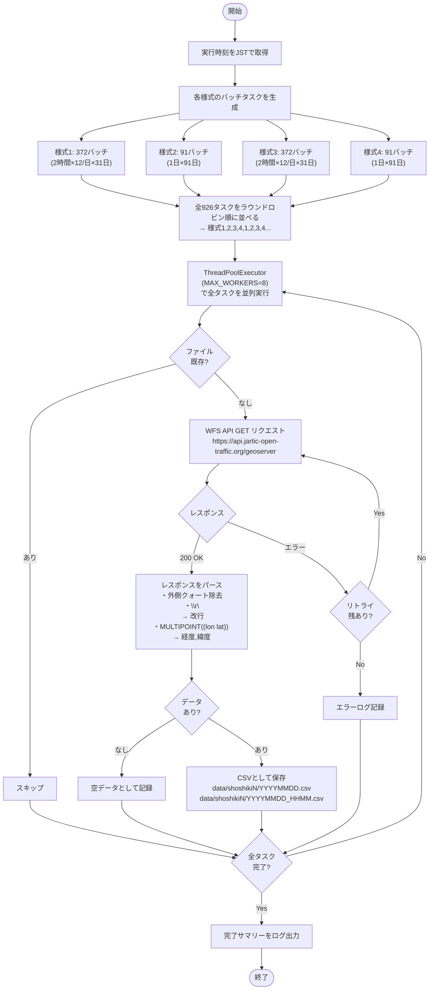

# japan-mlit-traffic-data

国土交通省が提供する [JARTIC オープン交通データ](https://www.jartic-open-traffic.org/) を一括取得するスクリプト。

全国2,060ヶ所の一般国道（直轄国道）における方向別交通量データをWFS APIで取得し、CSVとして保存・加工する。観測点のベクトルタイル（PMTiles）と時刻別交通量JSONを生成し、MapLibre GL JSビューワーで可視化する。

## データ概要

| 様式 | 観測方法 | 集計単位 | 提供期間 | layer名 |
|------|---------|---------|---------|---------|
| 様式1 | 常設トラカン | 5分間 | 過去1ヶ月 | `t_travospublic_measure_5m` |
| 様式2 | 常設トラカン | 1時間 | 過去3ヶ月 | `t_travospublic_measure_1h` |
| 様式3 | CCTVトラカン | 5分間 | 過去1ヶ月 | `t_travospublic_measure_5m_img` |
| 様式4 | CCTVトラカン | 1時間 | 過去3ヶ月 | `t_travospublic_measure_1h_img` |

- 道路種別: 一般国道（コード `3`）のみ
- 座標系: WGS84（EPSG:4326）
- 利用前に [交通量API利用規約](https://www.jartic-open-traffic.org/) への同意が必要

## 処理フロー


```mermaid
flowchart TD
    A([開始]) --> B[実行時刻をJSTで取得]
    B --> C[各様式のバッチタスクを生成]

    C --> C1["様式1: 372バッチ<br>(2時間×12/日×31日)"]
    C --> C2["様式2: 91バッチ<br>(1日×91日)"]
    C --> C3["様式3: 372バッチ<br>(2時間×12/日×31日)"]
    C --> C4["様式4: 91バッチ<br>(1日×91日)"]

    C1 & C2 & C3 & C4 --> D["全926タスクをラウンドロビン順に並べる<br>→ 様式1,2,3,4,1,2,3,4..."]

    D --> E["ThreadPoolExecutor<br>(MAX_WORKERS=8)<br>で全タスクを並列実行"]

    E --> F{ファイル<br>既存?}
    F -- あり --> G[スキップ]
    F -- なし --> H["WFS API GET リクエスト<br>https://api.jartic-open-traffic.org/geoserver"]

    H --> I{レスポンス}
    I -- 200 OK --> J["レスポンスをパース<br>・外側クォート除去<br>・\\r\\n → 改行<br>・MULTIPOINT((lon lat)) → 経度,緯度"]
    I -- エラー --> K{リトライ<br>残あり?}
    K -- Yes --> H
    K -- No --> L[エラーログ記録]

    J --> M{データ<br>あり?}
    M -- なし --> N[空データとして記録]
    M -- あり --> O["CSVとして保存<br>data/shoshikiN/YYYYMMDD.csv<br>data/shoshikiN/YYYYMMDD_HHMM.csv"]

    G & L & N & O --> P{全タスク<br>完了?}
    P -- No --> E
    P -- Yes --> Q[完了サマリーをログ出力]
    Q --> R([終了])
```

## 出力ファイル

```
data/
├── shoshiki1/          # 様式1: 常設トラカン 5分間
│   ├── 20260101_0000.csv   # 00:00〜01:55 のデータ
│   ├── 20260101_0200.csv   # 02:00〜03:55 のデータ
│   └── ...                 # 2時間単位、12ファイル/日
├── shoshiki2/          # 様式2: 常設トラカン 1時間
│   ├── 20251227.csv        # 1日分のデータ
│   └── ...                 # 1ファイル/日
├── shoshiki3/          # 様式3: CCTVトラカン 5分間
│   └── ...                 # 様式1と同形式
└── shoshiki4/          # 様式4: CCTVトラカン 1時間
    └── ...                 # 様式2と同形式
```

### CSVカラム（様式1, 2）

```
FID, 地方整備局等番号, 開発建設部／都道府県コード, 常時観測点コード,
収集時間フラグ（5分間／1時間）, 観測年月日, 時間帯,
上り・小型交通量, 上り・大型交通量, 上り・車種判別不能交通量,
上り・停電, 上り・ループ異常, 上り・超音波異常, 上り・欠測,
下り・小型交通量, 下り・大型交通量, 下り・車種判別不能交通量,
下り・停電, 下り・ループ異常, 下り・超音波異常, 下り・欠測,
道路種別, 時間コード, 経度, 緯度
```

- `経度` / `緯度`: WGS84（EPSG:4326）。QGISやGeoJSONへの変換が容易
- 欠測の場合は該当フィールドが空欄
- 様式3, 4はカメラ品質フラグ列が追加される（カラム名も異なる: `上り・小型交通量（集計値）` など）

## 必要環境

- Python 3.10+（標準ライブラリのみ使用）

## 使い方

### 1. データダウンロード

```bash
python scripts/download_jartic.py
```

### 2. 前処理（観測点GeoJSON + 時刻別JSON生成）

```bash
python scripts/process_csv.py
```

出力先: `docs/`

| ファイル | 内容 | サイズ |
|---------|------|--------|
| `docs/stations.geojson` | 観測点マスタ (2,060点) | 656KB |
| `docs/data_5m/YYYYMMDD.json.gz` | 5分間交通量・日別 (様式1+3、API提供期間の直近1ヶ月分) | ~2.6MB/日 |
| `docs/data_1h_all.json.gz` | 1時間交通量・全期間統合（API提供期間の直近3ヶ月分。過去分の蓄積はしない） | ~30MB |

### 3. ベクトルタイル生成（tippecanoe v2.17+ が必要）

```bash
# PMTiles（MapLibre GL JS用）
tippecanoe \
  -o docs/stations.pmtiles \
  --name=jartic-stations \
  --layer=stations \
  -z14 -Z5 \
  -r1 \
  --force \
  docs/stations.geojson
```

tippecanoe のインストール: https://github.com/felt/tippecanoe

### 設定（`scripts/download_jartic.py` 冒頭）

| 設定項目 | デフォルト | 説明 |
|---------|-----------|------|
| `MAX_WORKERS` | `8` | 並列ワーカー数（コア数に合わせて調整） |
| `MAX_RETRIES` | `3` | APIエラー時のリトライ回数 |
| `RETRY_DELAY_SEC` | `10` | リトライ間隔（秒） |
| `DATASETS[*].enabled` | `True` | 取得しない様式は `False` に設定 |

### 推計スペック（全様式取得時）

| 項目 | 値 |
|-----|---|
| 総リクエスト数 | 926回 |
| 所要時間 | 約8分（8並列） |
| ディスク使用量 | 約3.1GB |

### 再実行・レジューム

既存ファイルは自動でスキップされる。中断後の再実行でも途中から継続可能。

## 災害時の交通量異常検知

指定日の交通量を「前1週・前2週の同曜日」と比較し、都道府県別の中央値変化率を算出する。
平常日の同計算結果を分布として持ち、その中での位置（パーセンタイル）で「通常のばらつきの範囲か」を判定する。

```bash
# 判定（複数日を指定可。--csv で結果をCSV出力）
python scripts/analyze_disaster.py 20260813 20260814

# 可視化HTML生成（docs/disaster/index.html）
python scripts/analyze_disaster.py 20260807 20260808 20260809 20260810 \
    20260811 20260812 20260813 --csv /tmp/disaster_week.csv --top 47
python scripts/build_disaster_viz.py --csv /tmp/disaster_week.csv \
    --track scripts/assets/typhoon_2613_track.json
```

### 検証済みの検出例

| 日付 | 都道府県 | 中央値変化率 | 事象 |
|---|---|---|---|
| 2026/8/7 | 沖縄県 | -82.6% | 台風13号(DOLPHIN) 沖縄本島最接近 |
| 2026/8/13 | 千葉県 | -24.4% | 線状降水帯による豪雨（関東各県が同時に低下） |

お盆期間は全国的にむしろ交通量が増える（全国中央値 +4.7〜+13.3%）ため、災害による低下はかえって際立つ。

### この指標の限界

- **冠水地点は特定できない。** 対象は直轄の一般国道のみで、冠水が起きやすいアンダーパス・県道・市道は元データに含まれない
- **被災県の同定はできない。** 捉えているのは「広域の悪天候で運転が減ったこと」であり、隣接する非被災県が同等以上に低下することがある（8/14は東京 -21.7% が千葉 -17.8% を上回った）
- **単独の閾値判定では誤検知が多い。** 閾値-20%で平常日の1.10%が発火（47県なら約0.5県/日）。隣接する複数県が同時に低下しているかを併せて見る必要がある
- **センサー全欠測を「交通量0」と誤認しない**よう、有効コマ8割未満の観測点は除外している（実際に2026/8/14の観測点3110510は288コマ全欠測で、素朴に集計すると-100%＝完全通行止めに見える）

台風経路データは気象庁 [台風位置表](https://www.data.jma.go.jp/typhoon/position_table/table2026.html) のPDF（速報値）から抽出し `scripts/assets/` に格納している。

## データ配信（gh-pagesブランチ）

クラウドストレージ（S3等）は使用していません。`docs/` 一式（ビューワー本体 + データファイル）を `gh-pages` ブランチに直接デプロイし、GitHub Pagesから配信します。

- `main` ブランチ: ソースコードのみ（`data_5m/`・`data_1h_all.json.gz`・`stations.pmtiles`・`stations.geojson`・ビルド成果物は`.gitignore`対象）
- `gh-pages` ブランチ: 実行のたびに **orphan commit で全差し替え**（履歴を残さないため、リポジトリサイズは常に一定・約120MB程度に保たれる）
- データの過去分蓄積は行わない。API提供期間（5分間データ=直近1ヶ月、1時間データ=直近3ヶ月）がそのまま反映される

> **注意:** S3のRefererアクセス制限のような仕組みはないため、データファイルは誰でも直接ダウンロード可能です。JARTICの利用規約上「再配布の制限」に抵触しないよう、内容・利用範囲には注意してください。

## 自動更新（GitHub Actions）

`.github/workflows/update-data.yml` により **手動実行**（`workflow_dispatch`）に加え、**毎週月曜 4:00 JST（日曜19:00 UTC）に自動実行**（`schedule`）します。

| ステップ | 内容 |
|---------|------|
| CSVキャッシュ復元 | 前回の `data/` を再利用し差分ダウンロードのみ実施 |
| `download_jartic.py` | 新しいCSVのみ取得（既存ファイルはスキップ） |
| `process_csv.py` | 全データをJSON.gzに変換（API提供期間の直近分のみ、過去蓄積なし） |
| tippecanoeインストール・`stations.pmtiles`生成 | ソースからビルド |
| ビューワービルド | `npm run build` で `docs/` にビルド成果物を出力 |
| `gh-pages`へデプロイ | `docs/` 一式を `gh-pages` ブランチへ orphan commit で全差し替え |

AWS等の外部サービス・Secretsは不要です。

## ビューワー設計方針（MapLibre GL JS）

タイトル: **国土交通省 交通量ビューワー（JARTIC提供）**

| モード | スライダー範囲 | 日付選択 | データ |
|--------|-------------|---------|--------|
| 5分間 | 1日分（288コマ） | プルダウン（年月日） | `data_5m/YYYYMMDD.json.gz` を日付変更時フェッチ（同一オリジンの`data_5m/index.json`から利用可能日付を取得） |
| 1時間 | API提供期間（直近3ヶ月） | なし（スライダーで全期間・最新位置から開始） | `data_1h_all.json.gz` をページロード時一括フェッチ（日次キャッシュバスト） |

- `stations.pmtiles` で観測点位置を描画
- 時刻別JSONの `観測点コード` をキーに交通量を紐付け
- `setPaintProperty` で色のみ更新（ジオメトリ再描画なし）

## QGISでの利用

### CSVを直接表示

1. レイヤ → レイヤを追加 → テキストの区切り文字ファイルレイヤを追加
2. X フィールド: `経度`、Y フィールド: `緯度` を指定
3. 座標系: EPSG:4326 を選択

### ベクタータイル（MBTiles）を表示

1. レイヤ → レイヤを追加 → **ベクタータイルレイヤを追加**
2. ソース: ファイル → `stations.mbtiles` を指定

## 利用条件・出典表記

本スクリプトで取得するデータは **交通量データ（国土交通省）** です。JARTICオープン交通データとして公開されており、利用前に [交通量API利用規約](https://www.jartic-open-traffic.org/) への同意が必要です。

### 出典表記（必須）

データを地図・レポート・Webアプリ等で使用する場合は、以下に準じた出典を明記してください。

```
出典：国土交通省 交通量データ（JARTIC提供）（参考値）
```

- **「参考値」の明示が必要です。** 本データは正式な交通量調査結果ではなく、機器の状態や気象等により欠測・異常値が含まれる可能性があります。
- 分析結果・可視化結果を公開する際も、出典と参考値である旨を併記してください。

### 二次配布・再公開の制限

- APIレスポンスのCSV・GeoJSON・PMTiles等を**そのままWeb上に再公開することは制限されています。**
- `output/` 以下のファイルは自己利用・内部共有の範囲にとどめ、不特定多数への再配布は行わないでください。

## 注意事項

- **本データは参考値です。** 国土交通省による正式な交通量調査結果ではありません。
- 欠測・異常値が含まれる可能性があります（気象・停電・機器障害等が原因）。GIS分析では外れ値処理や欠測補完の設計を前提としてください。
- 近畿地方整備局のCCTVトラカンは様式3のみ提供（様式4なし）
- APIレスポンスの上限は約6MB（バッチサイズはこれを考慮して設定済み）

## 参考資料

- [JARTIC オープン交通データ ガイダンスサイト](https://www.jartic-open-traffic.org/)
- [交通量API仕様書（APIリクエストの作成方法）](https://www.jartic-open-traffic.org/action_method.pdf)
- [交通量データ利用の手引き](https://www.jartic-open-traffic.org/%E5%9B%BD%E5%9C%9F%E4%BA%A4%E9%80%9A%E7%9C%81%E4%BA%A4%E9%80%9A%E9%87%8FAPI%E4%BB%95%E6%A7%98%E6%9B%B8%EF%BC%88API%E3%83%AA%E3%82%AF%E3%82%A8%E3%82%B9%E3%83%88%E3%81%AE%E4%BD%9C%E6%88%90%E6%96%B9%E6%B3%95%EF%BC%89.pdf)
